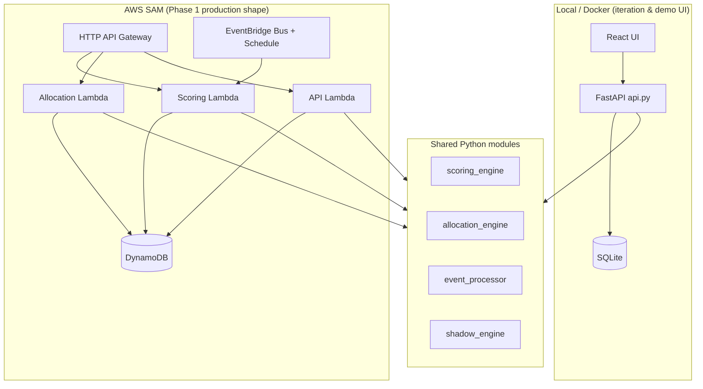

# Newton 3 — Architecture (Phase 1 + Hackathon)

This document maps the **hackathon prototype** to the **Wayleadr Phase 1 AWS design** (isolated Newton, migration-first, shadow validation). Reviewers can read this without running the repo.

**Demo video:** https://www.loom.com/share/d7478cd7208a498cba2b2272b6b4a42c (Metabase CSV import + feature walkthrough)  
**Submission repo:** `wayleadr-internal/shakeel-allocation-prototype`

---

## 1. Strategic intent

| Today (Rails) | Phase 1 (this project) |
|---------------|------------------------|
| Opaque sort rules | Transparent 4-layer priority |
| No user-visible behaviour signal | Behaviour score + tiers |
| Monolith allocation | Isolated Newton on AWS |
| Hard to explain | Rule explain + optional LLM narrative |

**Rails is source-only for migration** — runtime has no Rails dependency.

---

## 2. Dual runtime (same business logic)

**Full serverless review (gaps, AWS service matrix, rollout phases):** [docs/AWS_SERVERLESS_ARCHITECTURE.md](docs/AWS_SERVERLESS_ARCHITECTURE.md).



| Layer | Local | AWS |
|-------|-------|-----|
| API | FastAPI + static React (all routes) | API Gateway v2 + Lambdas (**subset** of routes today) |
| Store | `SqliteStore` | `DynamoDBStore` |
| Events | HTTP `/api/events` | EventBridge + POST `/api/events` |
| Decay | `weekly_decay` event | EventBridge `rate(7 days)` |
| Explain / LLM | Ollama in Docker | Template fallback or Bedrock (target) |
| UI hosting | Vite dev / `ui/dist` via FastAPI | Target: S3 + CloudFront |

**Single source of truth for rules:** `scoring_engine.py`, `allocation_engine.py`, `event_processor.py`.

**Structural rule:** Lambdas in `aws/handlers/` are thin; they call the same functions as `api.py`. Never fork penalty or sort logic in handlers.

---

## 3. Priority model (allocation)

```python
# allocation_engine.allocation_sort_key — ascending sort
(group_priority, user_priority, -behavior_score, tie_breaker)
```

**Restricted tier** (score &lt; 50): ranked after all eligible users so they do not take a slot while better-tier users exist in the pool.

**Shadow mode:** `shadow_engine.rank_legacy` ignores behaviour score; `/api/allocation/shadow` and Lambda `GET /api/allocation/shadow` compare Newton vs legacy.

---

## 4. Behaviour score model

| Concept | Value |
|---------|--------|
| Base score | 100 |
| Min score | 0 |
| No-show (unused booking) | −3 (tenant override) |
| Free space usage | −1 |
| Offence | −5 |
| Carpool reward | +5 (rolling cap 20 / 28 days) |
| Weekly decay | +2/week toward base (capped) |

**Tiers:** Platinum ≥150, Gold ≥120, Silver ≥80, Bronze ≥50, Restricted &lt;50.

---

## 5. AWS data model (DynamoDB)

Aligned with the Phase 1 design doc (simplified keys for SAM).

| Table | PK | SK | Contents |
|-------|----|----|----------|
| `newton3-{stage}-users-scores` | `USER#{id}` | `PROFILE` / `SCORE` | Priorities + score JSON |
| `newton3-{stage}-behavior-events` | `USER#{id}` | `EVENT#{inv_ts}#…` | Event log + score snapshots |
| `newton3-{stage}-tenant-config` | `GROUP#{id}` | `WEIGHTS` | Per-tenant weights |
| `newton3-{stage}-groups` | `GROUP#{id}` | `META` | Group priority registry |
| `newton3-{stage}-allocation-runs` | `RUN#{id}` | `META` / `WINNER#…` | Persisted allocation decisions |

Implementation: `dynamodb_store.py`.

**Future:** DynamoDB Global Tables + WayID regional routing (EU `eu-west-1`, US `us-west-1`).

---

## 6. Event-driven scoring

| Event | Effect |
|-------|--------|
| `booking.created` / `cancelled` / `completed` | Logged; no score change (Phase 1) |
| `unused_booking` | Penalty |
| `free_space_used` | Penalty |
| `offence.reported` | Penalty |
| `carpool.detected` | Reward (capped) |
| `weekly_decay` | Recovery toward 100 |

**AWS path:** producers publish to custom bus `newton3-{stage}-events` with `source` e.g. `newton3.booking` → Scoring Lambda.

**Local path:** `POST /api/events` → `event_processor.process_event`.

---

## 7. Migration (Rails → AWS)

**No production credentials.** Use anonymized CSV exports.

```
Rails DB → export CSV → migrate_from_rails_export.py → DynamoDB
                              ↓
                        audit JSON (counts, errors)
```

| File | Purpose |
|------|---------|
| `fixtures/migration/groups.csv` | Group priorities |
| `fixtures/migration/users.csv` | Users + memberships |
| `fixtures/migration/events.csv` | Optional behaviour replay |

Properties: **idempotent** user upsert, **auditable** stdout JSON, **incremental** (re-run with delta CSVs).

See `docs/DEPLOY_AWS.md` for deploy + migrate commands.

---

## 8. Shadow validation (Phase 1 acceptance)

1. Export legacy ordered list (or use in-app legacy mock).
2. Run Newton rank on same pool + seed.
3. `shadow_compare` Lambda or `GET /api/allocation/shadow` → position deltas.
4. CloudWatch metric/alarm on mismatch count (hook in production).

**Acceptance:** exact match or documented variance (tie-breaker seed).

---

## 9. API surface (WayID-compatible)

| Method | Path | Purpose |
|--------|------|---------|
| GET | `/users/{id}/behavior-score` | Score + tier (spec) |
| GET | `/api/users/{id}/behavior-score` | Same (prefixed) |
| POST | `/api/events` | Ingest behaviour event |
| GET | `/api/allocation/rank` | Full ranking |
| GET | `/api/allocation/allocate` | Winners + persist run |
| GET | `/api/allocation/shadow` | Newton vs legacy |
| GET | `/api/health` | Feature flags |

Local FastAPI exposes the full admin/UI surface; AWS stack exposes Phase 1 core paths above.

---

## 10. Security (Phase 1)

- IAM least-privilege per Lambda (SAM policies)
- DynamoDB encryption at rest (AWS default)
- API Gateway TLS
- No Wayleadr secrets in repo; hackathon uses **your** AWS account
- Admin reset / bulk APIs: **disabled on public AWS** (local demo only) — add Cognito/API keys before prod

---

## 11. Observability

| Signal | Local | AWS |
|--------|-------|-----|
| Structured logs | `observability.emit` | CloudWatch Logs |
| Score updates | SQLite snapshots | `behavior-events` table |
| Migration | CLI JSON audit | Same + optional S3 artifact |
| Shadow mismatch | API JSON | `ShadowCompareFunction` |

Env: `NEWTON3_LOG_JSON=1` for JSON log lines.

---

## 12. Rollout alignment

| Phase | Delivered here |
|-------|----------------|
| **0 — Local** | `run_local.py`, SQLite, full FastAPI + React, Docker + Ollama |
| **1 — Foundation** | AWS SAM, DDB, migration script, shadow compare, isolated stack |
| **1b — API parity** | **Done:** Console Lambda (Mangum) + SQS scoring pipeline (see serverless doc) |
| **2 — Admin visibility** | React Tenant/Reports tabs (local); S3/CloudFront + Cognito on AWS |
| **3 — User UX** | `UserScorePage`, tier charts |
| **4 — Platform** | Bedrock LLM, EventBridge from Rails, CloudWatch shadow alarms |

---

## 13. Repository map

See [docs/PROJECT_STRUCTURE.md](docs/PROJECT_STRUCTURE.md). Summary:

| Path | Role |
|------|------|
| `newton3/domain/` | Core rules (`scoring_engine`, `allocation_engine`, `event_processor`, …) |
| `newton3/persistence/` | `sqlite_store`, `dynamodb_store`, `store_factory` |
| `newton3/api/app.py` | Full demo API + UI |
| `newton3/services/` | `events_queue`, `llm_explain`, `cohort_import` |
| `aws/handlers/` | Lambda entrypoints |
| `infra/sam/template.yaml` | IaC |
| `run_local.py` | Local Uvicorn + SQLite |
| `ui/` | React operator console |
| `tests/` | Unit/API tests |

---

## 14. What judges should try (no local run required)

1. Watch **Loom** demo.
2. Read this file + `docs/SUBMISSION.md`.
3. Optional: deploy SAM in reviewer AWS account (`docs/DEPLOY_AWS.md`) — ~10 min on Free Tier.

**Contact:** repository owner via `wayleadr-internal` GitHub org.
