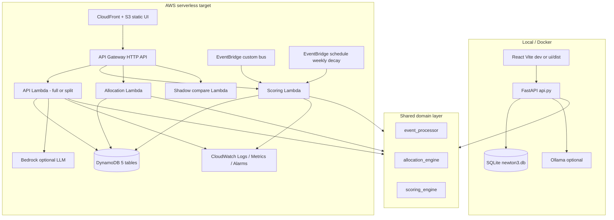

# Newton 3 — AWS serverless architecture (review)

This document is the **architectural review** for deploying Newton 3 on **maximum AWS managed services** while keeping **full local parity** via **SQLite** (`run_local.py`, Docker). It complements [ARCHITECTURE.md](../ARCHITECTURE.md) and [DEPLOY_AWS.md](./DEPLOY_AWS.md).

---

## 1. Design principles

| Principle | Implementation |
|-----------|----------------|
| **One rules engine** | `scoring_engine.py`, `allocation_engine.py`, `event_processor.py`, `shadow_engine.py` — no duplicate business logic in Lambdas |
| **Adapter stores** | `SqliteStore` (local) and `DynamoDBStore` (AWS) implement the same `ScoreStore` surface |
| **Local = full product** | FastAPI `api.py` exposes admin, reports, LLM, CSV import, full React UI |
| **AWS = production slice first** | SAM today exposes Phase 1 **core** HTTP + EventBridge; expand to full API behind one gateway |
| **Rails is migration-only** | `scripts/migrate_from_rails_export.py` → DynamoDB (or SQLite for local seed) |

---

## 2. Runtime comparison



---

## 3. AWS services — use today vs target

| AWS service | Status today (`infra/sam/template.yaml`) | Role | Local equivalent |
|-------------|------------------------------------------|------|------------------|
| **Lambda** | 4 functions (scoring, allocation, api, shadow) | Compute; ARM64 Python 3.11 | Uvicorn + `api.py` |
| **API Gateway HTTP API** | Partial routes only | HTTPS edge, CORS | `127.0.0.1:8765` |
| **DynamoDB** | 5 on-demand tables | Users, events, tenant weights, groups, allocation runs | `SqliteStore` |
| **EventBridge** | Custom bus + `rate(7 days)` decay rule | Async behaviour events + schedule | `POST /api/events` |
| **IAM** | SAM `Policies` per function | Least privilege | N/A |
| **CloudWatch Logs** | Automatic via Lambda | Logs (`observability.emit`) | stdout / `NEWTON3_LOG_JSON` |
| **CloudFormation / SAM** | `template.yaml` | IaC, repeatable deploy | `run_local.py` |
| **S3 + CloudFront** | Not in stack | Host `ui/dist` SPA | FastAPI static mount or Vite |
| **Cognito / IAM authorizer** | Not in stack | Auth for admin APIs | Open local demo |
| **Secrets Manager / SSM** | Not in stack | LLM keys, tenant secrets | `.env` / compose env |
| **Amazon Bedrock** | Not in stack | Production LLM explain | Ollama in Docker |
| **SQS** | Not in stack | Buffer spikes from Rails webhooks | Direct HTTP POST |
| **EventBridge Pipes / Kinesis** | Not in stack | Rails → bus fan-in | N/A |
| **Step Functions** | Not in stack | Migration / shadow batch jobs | CLI script |
| **X-Ray** | Not enabled | Trace API → DDB | N/A |
| **WAF** | Not in stack | Protect public API | N/A |
| **DynamoDB Global Tables** | Not in stack | EU + US (WayID regions) | Single SQLite file |

**Maximize AWS without breaking local:** keep all rule changes in shared modules; only `sqlite_store.py` / `dynamodb_store.py` and thin `aws/handlers/*` differ.

---

## 4. Data layer contract

Both stores must support what `event_processor` and `allocation_engine` need:

| Capability | SQLite | DynamoDB |
|------------|--------|----------|
| User profile + score state | Yes | Yes |
| Groups + tenant weights | Yes | Yes |
| Event log + score snapshots (`score_before`, `score_delta`) | Yes | Yes |
| Allocation run persistence | Yes | Yes |
| `list_score_history` | Yes | Yes |
| `recent_events(user_id=)` | Yes | Yes |
| `clear_all_data` (admin reset) | Yes | Yes (dev only) |

**Table mapping (AWS):**

| Table | PK | SK | Purpose |
|-------|----|----|---------|
| `newton3-{stage}-users-scores` | `USER#{id}` | `PROFILE` / `SCORE` | Identity + behaviour score |
| `newton3-{stage}-behavior-events` | `USER#{id}` | `EVENT#{inv_ts}#…` | Audit + snapshots |
| `newton3-{stage}-tenant-config` | `GROUP#{id}` | `WEIGHTS` | Penalties / caps |
| `newton3-{stage}-groups` | `GROUP#{id}` | `META` | Group priority |
| `newton3-{stage}-allocation-runs` | `RUN#{id}` | `META` / `WINNER#…` | Decisions |

Implementation: `dynamodb_store.py`, `sqlite_store.py`.

---

## 5. API surface — local vs deployed (gap)

FastAPI (`api.py`) exposes **~25 routes**. SAM HTTP API today exposes **subset**:

| Area | Local (`api.py`) | AWS SAM today |
|------|------------------|---------------|
| Health | `GET /api/health` | Yes (api Lambda) |
| Behaviour score (WayID) | `GET /users/{id}/behavior-score` | Yes |
| Log event | `POST /api/events` | Yes (scoring Lambda) |
| Recent events + deltas | `GET /api/events/recent` | **No** |
| Bulk events | `POST /api/events/bulk` | **No** |
| Users / groups list | `GET /api/users`, `/api/groups` | **No** |
| Score history / insights | `GET /api/users/{id}/score-history`, `/insights` | **No** |
| Allocation rank/allocate/shadow/explain | Yes | rank, allocate, shadow, explain |
| Allocation runs | `GET /api/allocation/runs` | **No** |
| Admin reset / import CSV | `POST /api/admin/*` | **No** (intentionally) |
| Fairness reports | `GET /api/reports/fairness*` | **No** |
| LLM explain | `POST /api/allocation/explain-llm` | **No** |

**Recommended Phase 1b (minimal change):** one **monolithic API Lambda** using [Mangum](https://mangum.io/) over `create_app()` from `api.py`, with `NEWTON3_STORE=dynamodb` and admin routes gated by env. Keeps one codebase; API Gateway routes `/{proxy+}`.

**Alternative:** keep split Lambdas and add routes to `template.yaml` (more IAM duplication, harder to maintain).

---

## 6. Event flows

### Local

```
UI → POST /api/events → event_processor → SqliteStore
                      → record_score_history (score_before, delta)
UI → GET /api/events/recent → enrich from list_score_history
```

### AWS (current)

```
Producer → EventBridge (newton3-{stage}-events)
         → Scoring Lambda → process_event → DynamoDBStore

HTTP POST /api/events → same Scoring Lambda

EventBridge rate(7 days) → Scoring Lambda → weekly_decay per user
```

### AWS (target integrations)

```
Rails / booking service → EventBridge PutEvents (source: newton3.booking)
Gate / offence systems   → newton3.gate / newton3.offence
Optional buffer          → SQS → Lambda (batch process_event)
```

---

## 7. Repository layers (structural)

```
newton3/                     # Python package (see docs/PROJECT_STRUCTURE.md)
├── domain/                  # scoring, allocation, events, shadow, fairness
├── persistence/             # store, sqlite, dynamodb, factory
├── services/                # events_queue, cohort_import, llm_explain
├── api/app.py               # FastAPI (local + Mangum console)
aws/handlers/*.py            # Lambda entry (thin)
├── UI
│   ui/                      ← build to dist; S3 in prod
├── IaC
│   infra/sam/template.yaml
└── Ops
    scripts/migrate_from_rails_export.py
    docs/DEPLOY_AWS.md
```

**Rule:** Lambdas and FastAPI must call `process_event`, `rank_users`, `allocate_spaces` — never reimplement penalties in handlers.

---

## 8. Environment variables

| Variable | Local | AWS Lambda |
|----------|-------|------------|
| `NEWTON3_DB_PATH` | `./data/newton3.db` | — |
| `NEWTON3_DDB_*_TABLE` | — | Set by SAM `Globals.Function.Environment` |
| `NEWTON3_LOG_JSON` | Optional | `1` recommended |
| `NEWTON3_LLM_URL` / `MODEL` | Ollama | Bedrock or external URL |
| `NEWTON3_CORS_ORIGINS` | `*` dev | CloudFront origin |
| `NEWTON3_STORE` | implicit sqlite | `dynamodb` (future factory in `api.py`) |

---

## 9. Phased serverless rollout

| Phase | Deliverable | AWS services |
|-------|-------------|--------------|
| **0 — Now** | Local demo + tests | SQLite only |
| **1 — Done** | Core scoring + allocation + shadow | Lambda, HTTP API, DDB, EventBridge, IAM, CloudWatch |
| **1b — Done** | Console Mangum Lambda `ANY /{proxy+}` + SQS scoring worker | Deploy via `infra/sam/template.yaml` |
| **2 — Next** | Full React against AWS API | S3 + CloudFront; `VITE_API_BASE` = `HttpApiUrl` |
| **2** | Static UI | S3, CloudFront, ACM |
| **3** | Security | Cognito JWT authorizer; disable `/api/admin/*` in prod |
| **4** | LLM | **Done:** Bedrock Converse on Console Lambda (`NEWTON3_LLM_BACKEND=bedrock`) |
| **5** | Scale / multi-region | DDB Global Tables, regional API GW |
| **6** | Rails cutover | EventBridge from booking; SQS optional; shadow alarms |

---

## 10. Local development checklist

```bash
# Backend
python -m venv .venv && source .venv/bin/activate
pip install -r requirements-dev.txt
python run_local.py --reload --db ./data/newton3.db

# UI
cd ui && npm run dev

# Seed from migration CSVs into SQLite
python scripts/migrate_from_rails_export.py --backend sqlite --dir fixtures/migration

# Tests
pytest
```

Docker: `docker compose up --build` — same SQLite path inside volume, Ollama for LLM.

**AWS smoke (after `sam deploy`):** [DEPLOY_AWS.md](./DEPLOY_AWS.md).

---

## 11. SAM improvements (prioritized backlog)

1. **Mangum wrapper** — single Lambda for all `/api/*` + static config for DDB store factory.
2. **HTTP API** — `/{proxy+}` ANY → Mangum; keep Scoring on EventBridge for async-only producers.
3. **S3 + CloudFront** — deploy `ui/dist`; `VITE_API_BASE` at build time = `HttpApiUrl`.
4. **CloudWatch alarm** — shadow mismatch metric from `ShadowCompareFunction`.
5. **SSM parameters** — stage, feature flags (`NEWTON3_ADMIN_ENABLED=false`).
6. **Bedrock** — IAM policy + env for `explain-llm` in prod.
7. **Optional LocalStack / DynamoDB Local** — CI integration tests without AWS account (not required for hackathon).

---

## 12. What must never diverge

- Sort key: `(group_priority, user_priority, -behavior_score, tie_breaker)`
- Penalty/reward numbers (tenant overrides via `TenantWeights`)
- Tier thresholds
- Shadow comparison semantics (`shadow_engine.py`)
- Event → score mapping (`event_processor.py`)

CI should run `pytest` against **InMemoryStore** and optionally **SqliteStore** file; add a small **DynamoDB Local** job only when you need AWS adapter regression.

---

## 13. Summary

| Question | Answer |
|----------|--------|
| Can we run everything locally? | **Yes** — FastAPI + SQLite + React (+ optional Ollama). |
| Is AWS serverless started? | **Yes** — SAM stack with Lambda, API GW, DDB, EventBridge. |
| Is AWS at “maximum services”? | **Not yet** — UI, auth, full API parity, Bedrock, SQS, multi-region are documented targets. |
| How do we avoid two codebases? | **Shared domain** + **two stores** + thin HTTP adapters. |

Next implementation step for production parity: **Phase 1b** (Mangum + `NEWTON3_STORE=dynamodb`) and **S3/CloudFront** for the React app.
